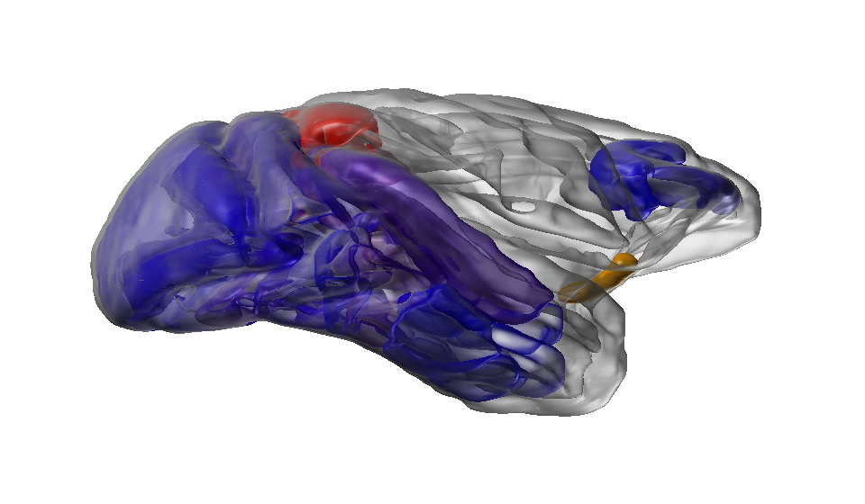

## Computational Neuroscience

- Schmidt M, Bakker R, Shen K, Bezgin G, Diesmann M, van Albada SJ (2018) A multi-scale layer-resolved spiking network model of resting-state dynamics in macaque visual cortical areas. PLoS Comput Biol 14(10): e1006359. [Link](https://journals.plos.org/ploscompbiol/article?id=10.1371/journal.pcbi.1006359)

   
   
- van Albada SJ., Rowley AG., Senk J., Hopkins M., Schmidt M., Stokes AB., Lester DR., Diesmann M., Furber SB. (2018) Performance comparison of the digital neuromorphic hardware SpiNNaker and the neural network simulation software NEST for a full-scale cortical microcircuit model. Frontiers in Neuroscience 12:291 DOI:10.3389/fnins.2018.00291 [Link](https://www.frontiersin.org/articles/10.3389/fnins.2018.00291/full)

   
   
- Schmidt M, Bakker R, Hilgetag C-C, Diesmann M, and van Albada SJ (2017) Multi-scale account of the network structure of macaque visual cortex. _Brain Structure and Function (2017)_, [Link](https://doi.org/10.1007/s00429-017-1554-4)

   

- Schuecker J*, Schmidt M*, van Albada SJ, Diesmann M, and Helias M. (2017) Fundamental activity constraints lead to specific interpretations of the connectome. _PLoS Computational Biology 13(2): e1005179_, [Link](http://journals.plos.org/ploscompbiol/article?id=10.1371/journal.pcbi.1005179) * Schuecker J and Schmidt M contributed equally.

   

## Scientific Software

- Kunkel S, Schmidt M, Eppler JM, Plesser HE, Masumoto G, Igarashi J, Ishii S, Fukai T, Morrison A, Diesmann M, and Helias M. (2014) Spiking network simulation code for petascale computers. _Frontiers in Neuroinformatics 8:78_ [Link](http://journal.frontiersin.org/article/10.3389/fninf.2014.00078/full)

   

- Nowke C, Schmidt M, van Albada SJ, Eppler JM, Bakker R, Diesmann M, Hentschel B and Kuhlen T (2013) \newline VisNEST—Interactive analysis of neural activity data. _IEEE Symposium on Biological Data Visualization (BioVis) 2013 (pp. 65-72)_ [Link](http://ieeexplore.ieee.org/document/6664348/?arnumber=6664348&tag=1)

   

## Quantum Mechanics

- Schmidt M, Erne S, Nowak B, Sexty D, and Gasenzer T. (2012) Non-thermal fixed points and solitons in a one-dimensional Bose gas. _New Journal of Physics, 14(7), 075005_ [Link](http://iopscience.iop.org/article/10.1088/1367-2630/14/7/075005/meta)

   

## General Interest

- Schmidt M, Schuecker J, van Albada SJ, Diesmann M, Helias M (2017), Stability Confinement of the Brain Connectome. _Inside - Innovatives Supercomputing in Deutschland_ [Link](http://inside.hlrs.de/assets/pdfs/inside_spring17.pdf)
- van Albada SJ, Diesmann M, Eppler JM, Hentschel B, Kuhlen T, Nowke C, Reske M, Schmidt
M (2014) Modellierung und 3D-Visualisierung neuronaler Netzwerke in der Größenordnung des
Gehirns. _RWTH Intern_
